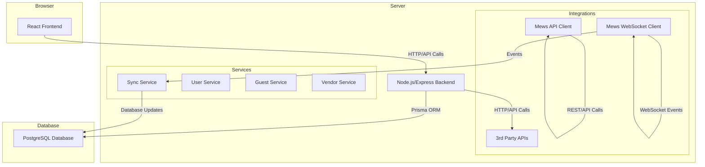

# System Patterns: Attendandt Architecture

## 1. High-Level Architecture

The system is designed as a modern web application with a clear separation of concerns between the frontend, backend, and shared components. It follows a monorepo approach to facilitate code sharing and streamlined development.

## 2. Backend Architecture

*   **Framework**: Node.js with Express.js for the core API, leveraging TypeScript for type safety.
*   **Database**: PostgreSQL managed via Supabase, with Prisma as the Object-Relational Mapper (ORM). This provides a powerful, type-safe interface to the database.
*   **Authentication**: Dual authentication system. Primary authentication is handled by Supabase Auth (JWT-based), with a legacy custom auth system for backward compatibility.
*   **Real-time Communication**: A WebSocket client connects to the Mews WebSocket (`wss://ws.mews-demo.com`) to receive real-time updates on reservations and other events. This is a critical component for keeping the platform's data in sync.
*   **Mews API Integration**: A dedicated Mews Connector client (`packages/backend/src/lib/mews.ts`) is responsible for all interactions with the Mews REST API. This client handles authentication, rate limiting, and error handling.
*   **Service-Oriented Design**: The backend is structured around services (e.g., `SyncService`, `GuestService`, `VendorService`) that encapsulate business logic. This promotes modularity and testability.
*   **Middleware Stack**: The Express app uses a well-defined middleware stack for handling authentication (auth), role-based access control (RBAC), rate limiting, and logging.

## 3. Frontend Architecture

*   **Framework**: React 18 with Vite for the build tool and development server. TypeScript is used for all frontend code.
*   **State Management**: Zustand for global client-side state, and React Query for managing server state (caching, refetching, and optimistic updates).
*   **Routing**: React Router v6 for all client-side routing, including a `ProtectedRoute` component that enforces authentication and role-based access.
*   **Component Structure**: Components are organized by feature (e.g., `guests`, `vendors`, `dashboard`) to keep the codebase modular and easy to navigate.
*   **Styling**: Tailwind CSS is used for all styling, following a utility-first approach.
*   **API Communication**: A central API client (using `axios` or `fetch`) handles all communication with the backend, including proxying requests during development.

## 4. Data Synchronization Pattern

The bidirectional sync between our platform and Mews is a core feature and has been implemented with the following patterns:

*   **Mews to Platform**: This is primarily driven by the WebSocket connection (`packages/backend/src/lib/mews.ws.ts`). When an event is received from Mews, the `SyncService` (`packages/backend/src/services/sync.service.ts`) is triggered to update the corresponding data in our PostgreSQL database via Prisma. A polling mechanism on the REST API can be used as a fallback.
*   **Platform to Mews**: When data is updated in our platform (e.g., a service charge is added), a service will make a call to the Mews API to update the corresponding record in Mews.
*   **Conflict Resolution**: A "last-write-wins" strategy is implemented as the default, with timestamp-based conflict resolution using the `syncedAt` field.
*   **Sync Tracking**: All models (User, Guest, Vendor) include `mewsId` and `syncedAt` fields to track synchronization status and prevent conflicts.

## 5. Key Design Patterns

*   **Dependency Injection**: A dependency container is used on the backend to manage and inject dependencies (like services and repositories), making the code more modular and testable.
*   **Repository Pattern**: Data access is abstracted through repositories (e.g., `UserRepository`), which provide a clean, consistent interface for database operations.
*   **DTOs (Data Transfer Objects)**: Shared DTOs, defined in the `@attendandt/shared` package, are used to ensure type safety and consistency for all data exchanged between the frontend and backend.
*   **Observer Pattern**: The real-time update system uses an observer pattern, where the `SyncService` observes WebSocket events and automatically updates the database when changes are received from Mews.
*   **Rate Limiting Pattern**: The Mews API client implements in-memory rate limiting to respect Mews API limits (500 requests per 15 minutes in demo environment).
*   **Retry Pattern**: The Mews API client uses exponential backoff retry logic for transient errors, implemented via `axios-retry`.

## 6. Mews Integration Patterns

*   **API Client Pattern**: Centralized Mews API client (`packages/backend/src/lib/mews.ts`) with authentication, rate limiting, and error handling.
*   **WebSocket Pattern**: Persistent WebSocket connection with automatic reconnection and event handling.
*   **Sync Service Pattern**: Event-driven sync service that processes WebSocket events and updates local database.
*   **Environment Configuration**: Mews credentials are managed through environment variables (`MEWS_CLIENT_TOKEN`, `MEWS_ACCESS_TOKEN`). 